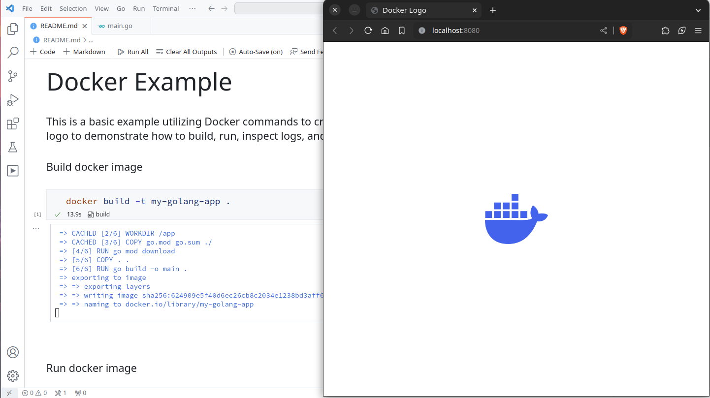

---
runme:
  id: 01HV5H4Z5Y2AAEF05KA5A4XBTP
  version: v3
---

# Docker Example

This is a basic example utilizing Docker commands to create and manage containers. The application should render a simple Docker logo to demonstrate how to build, run, inspect logs, and terminate a container effectively.



Build docker image

```sh {"id":"01HV5H519XBQM7B9P77JJ1J365","interactive":"true","name":"build","terminalRows":"10"}
docker build -t my-golang-app .
```

Run docker image

```sh {"id":"01HV5HZZBQH6X4W2K6SBRATYWB","interactive":"false","name":"start"}
export CONTAINER_ID=$(docker run -d -p 8080:8080 my-golang-app)
echo "Starting container ${CONTAINER_ID}"
```

Open the app

```sh {"cwd":"","id":"01HV7JZ0BREJV747MGDZ08N4JM","name":"open","terminalRows":"3"}
open http://localhost:8080
```

View container logs

```sh {"background":"true","id":"01HV7J6G8FF1AKT5AYJ60WZPB3","name":"logs"}
docker logs -f $CONTAINER_ID
```

Stop container

```sh {"excludeFromRunAll":"false","id":"01HV5J4EV5CAM278WDTNBHB0N4","interactive":"false","name":"stop"}
echo "Stopping container ${CONTAINER_ID}"
docker stop $CONTAINER_ID
```